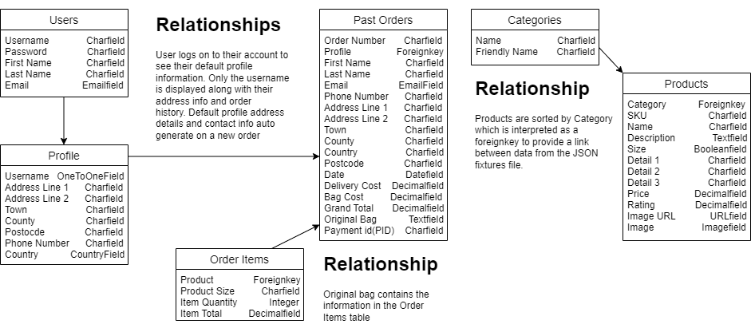
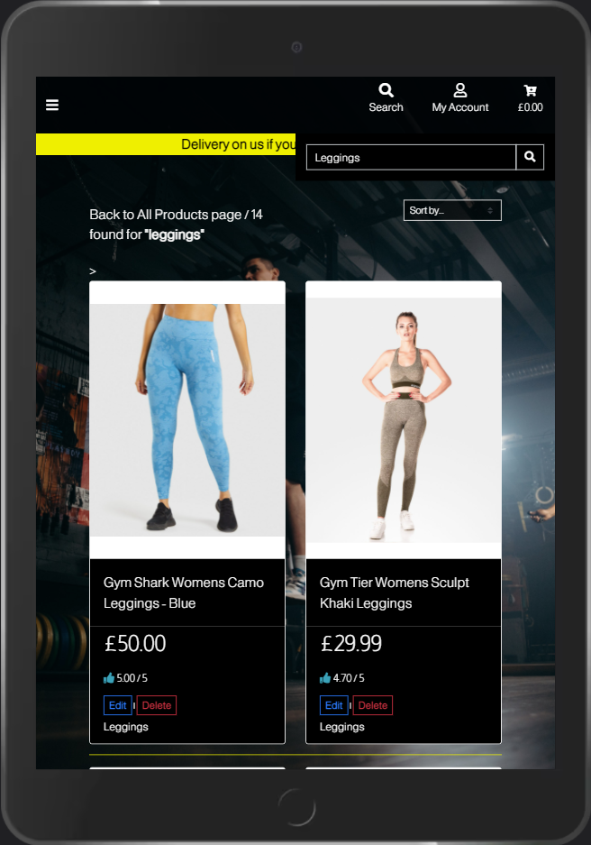
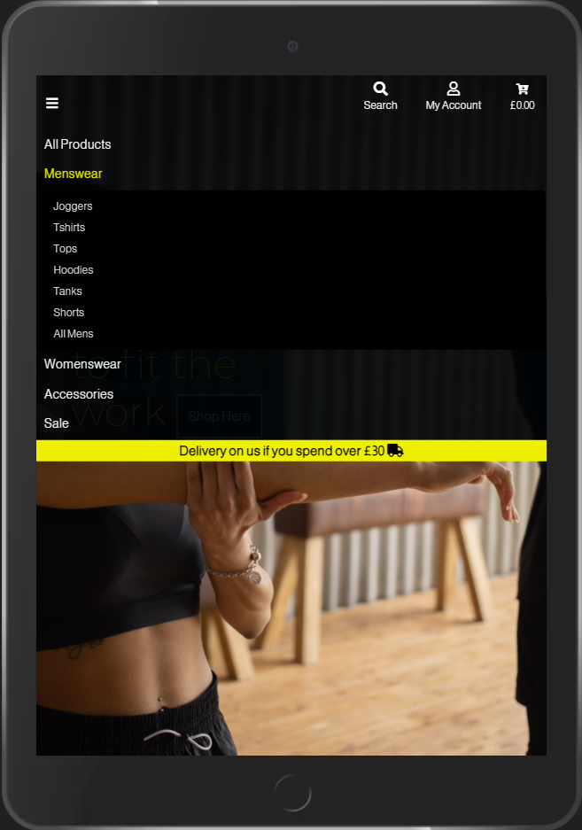
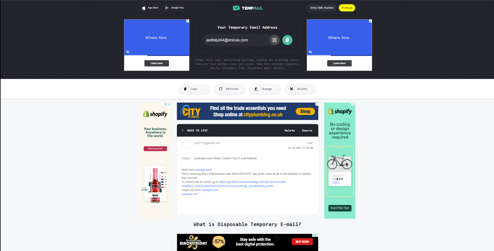

# Get The Fit - Milestone Project #4
# DISCLAIMER -  PLEASE READ!

This site is for educational purposes only. Any and all content used form a third party source shall not be used for profit. This content includes:

- Product Images
- Product descriptions
- Product prices
- Product overview

I hereby state that the site creator (myself) shall not re-use or re-publish such content for any other purposes without written consent from the orignal sources. A full list of content sources can be found [here](SOURCES.md).

 

# **Site Creator Overview** - UX
My objective for this fina project is to create an e-commerce site for users to browse gymwear and accessories. The site offers products from well known and established gymwear companies. Inspiration for this site was taken from existing 3rd party sites selling products made by high end brands, the only difference is that this site focusses on one demographic (being sports enthusiasts and gym members) rather than their sites product range which spans across general clothing sections such as jeans, tshirts, shirts and footwear which include both trainers and smart shoes.

 

 

# **User Stories**
## *First Time Visitor Goals*
- I want to be able to browse through products with easy naviagtion, this includes the use of a search bar and product links.
- I would like to check on product details and whether they have an option for different sizes and or colours.
- I would want to be able to check on how much I need to spend for any discount on delivery charges or free delivery
- I would like to have the ability to register my details and create an account

 

## *Frequent Visitor Goals*
- I would like to check for any new products in the store, this includes any sales and or promotions.
- I would like to browse through products and sort them by keyword, price and alphabetical order etc.
- I would like to add items to a shopping bag and  make a purhcase via a simple order form.
- I would like to be able to delete any unwanted items in my basket.
- I would like to be able to update the quantity of items in my shopping bag.

 

## *Returning Visitor Goals*
- I would like to log in to my account to view my purchase history.
- I would like to update billing details if I want to.

 

# **Site Creator Goals**
- To gain more popluarity with the fitness community through sales promotions and new products.
- To give users a good experience finding top end products at a good price.
- To to allow the site to be viewed on various devices like tablets, phones and desktop.
- To give users the ability to manipulate their shopping bag and delete items they no longer want.
- Give users ability to update the size and quantity of items in shopping bag.
- Add new products to the company database.

 

# **Future Site Creator Goals**
- To implement a review section so users can know what to look out for before purchasing it based on past experiences.
- To implement a blog section for potential fitness influencers and socail media figures to offer their insight in to the site.
- To implement form validations from the backend.
- To add a confirmation modal when user wants delete an item from their bag.

 

# **Features**
- A wide range good quality clothing from known retailers in the fitness industry
- Clear navigation with the use of a navigation bar and side navigation bar on mobile and tablet format
- Availability to access the site on various devices
- Register for an account
- Update their delivery infomation to auto fill in the checkout section

 

# **Technologies & Design**

   

## *Coding Languages*
* [HTML5](https://en.wikipedia.org/wiki/HTML5)
* [CSS3](https://en.wikipedia.org/wiki/CSS)
* [Javascript](https://en.wikipedia.org/wiki/JavaScript)
* [Python](https://en.wikipedia.org/wiki/Python_(programming_language))
* [JQuery](https://en.wikipedia.org/wiki/JQuery)

## *Libararies, Frameworks & Additional Programmes*
* Main site apps: [DJango](https://www.djangoproject.com/)
* Font icon kit sourced from [Font Awesome](https://fontawesome.com/)
* Containers, inline margin styling and colours using [Bootstrap 4.4.1](https://blog.getbootstrap.com/2019/11/28/bootstrap-4-4-1/)
* Montserrat & Almarai were sourced from [Google Fonts](https://fonts.google.com/)
* Frameworks were constructed using [Balsamiq](https://balsamiq.com/)
* Version control and to make good use of my git pod terminal to push my code from Git to [GitHub](https://git-scm.com/)
## *Installs*
* [Stripe](https://stripe.com/gb) for card payments
* [Django Crispy Forms](https://django-crispy-forms.readthedocs.io/) for the form styling.
* [Pillow](https://pypi.org/project/Pillow/) for image processing capabilities.
* [Django Countries](https://pypi.org/project/django-countries/) for the country dropdown.
* [gunicorn](https://gunicorn.org/)
* [boto3](https://boto3.amazonaws.com/v1/documentation/api/latest/guide/quickstart.html)
* [django storages](https://django-storages.readthedocs.io/en/latest/)

## *Wireframes*
* [Desktop view1](media/wireframes/Desktop-1.png)
* [Desktop view2](media/wireframes/Desktop-2.png)
* [iPad view1](media/wireframes/iPad-1.png)
* [iPad view2](media/wireframes/iPad-2.png)
* [iPad view3](media/wireframes/iPad-3.png)
* [iPhone view1](media/wireframes/iPhone-1.png)
* [iPhone view2](media/wireframes/iPhone-2.png)
* [iPhone view3](media/wireframes/iPhone-3.png)

## *Colour Scheme*
* The colour scheme for the design consists of blacks, yellows and blues (for free delivery suggestion text and shopping bag icon when products have been added - this actually came built in so I've decided to keep it as it goes well). The colour scheme is simple yet attractive to the user and doesn't overload their experice with too much noise. I like to call it simple but effective.
* I've also added a transparency effect to the nav bar with a stronger gradient on the nav link bar to set it apart to highlight the navlinks better. This instantly added more character and professionalism to the site.
## *Typography*
* Home Link & Page Titles - Montserrat. This font was chosen as the style goes well with a black background, an off-white colour was used to finish the look
* General Text - Almarai. I chose this font because it compliments the title and home logo text. This text also looks great when it's condensed down on mobile view and goes well in all product details and descriptions. An off-white color was also used. Both fonts used also have a default sans-serif text to fall back on incase of page issues.
## *Imagery*
* The imagery for this is pretty straight forward, the home page consists of one image spanning the entire cover of the page. The image used has the same colour scheme to make it sit well as the first impression a user would get to the layout. This was sourced for free from Artist 'Montsera' @ [Pexels.com](https://www.pexels.com/)
* Product Images & information was sourced from various companies, all of which can be found listed in the [SOURCES.md](SOURCES.md) file in this project.
* Size Guide image was sourced from [Roleur](https://www.rouleur.cc/)
* Each div overlay for the site also has a background image instead of the original idea of a simple black  background. This instantly worked in my favour because it makes the page in question pop out better and promotes good UX.

 

## *Home Page*
| Desktop | Phone | Tablet |
| :---: | :---: | :---: |
|  |  |  |

 

# **End User Testing - First Time Visitor Goals**

## *I want to be able to browse through products with easy naviagtion, this includes the use of a search bar and product links.*
### **Product Search**
| Desktop | Phone | Tablet |
| :---: | :---: | :---: |
|  |  |  |
### **Nav Link Example**
| Desktop | Phone | Tablet |
| :---: | :---: | :---: |
|  |  |  |

 

## *I would like to check on product details and whether they have an option for different sizes and or colours.*
| Phone | Desktop | Tablet |
| :---: | :---: | :---: |
|  |  |  |
|  |

 

## *I would want to be able to check on how much I need to spend for any discount on delivery charges or free delivery.*
| Nav Bar Deliver Banner |
| :---: |
|  |

 

## *I would like to have the ability to register my details and create an account.*
### **Navigating To Link**
| Desktop | Phone | Tablet |
| :---: | :---: | :---: |
|  |  |  |
### **Registering Details**
| Desktop | Phone | Tablet |
| :---: | :---: | :---: |
|  |  |  |
### **Verifying Details**
| Desktop | Phone | Tablet |
| :---: | :---: | :---: |
|  |  |  |

 

   

 

### **Confirming Email**
| Desktop | Phone | Tablet |
| :---: | :---: | :---: |
|  |  |  |
### **Sign-up Successful**
| Desktop | Phone | Tablet |
| :---: | :---: | :---: |
|  |  |  |

 

# **End User Testing - Frequent Visitor Goals**
## *I would like to browse through products and sort them by keyword, price and alphabetical order etc.*
| Desktop |
| :---: |
|  |
## *I would like to add items to a shopping bag and  make a purhcase via a simple order form.*
### **Adding To Bag**
| Desktop | Phone | Tablet |
| :---: | :---: | :---: |
|  |  |  |
### **Shopping Bag Page**
| Desktop | Phone | Tablet |
| :---: | :---: | :---: |
|  |  |  |
### **Checkout Page**
| Desktop | Phone | Tablet |
| :---: | :---: | :---: |
|  |  |  |
|| |  |

### **Order Confirmation**
| Phone | Desktop | Tablet |
| :---: | :---: | :---: |
|  |  |  |
|  |

## *I would like to be able to update the quantity of items with a size and without a size in my shopping bag.*

| Phone | Desktop ||
| :---: | :---: | :---: |
|  |  |  |
|  ||  ||

## *I would like to be able to delete any unwanted items in my basket*
 

| Phone | Desktop ||
| :---: | :---: | :---: |
|  |  |  |
|  ||  ||

 

# **End User Testing - Returning Visitor Goals**
## *I would like to log in to my account to view my purchase history.*
### **Navigating To Login Link**
| Desktop | Phone | Tablet |
| :---: | :---: | :---: |
|  |  |  |
### **Log In**
| Desktop | Phone | Tablet |
| :---: | :---: | :---: |
|  |  |  |
### **Navigatin To Profile Link**
| Desktop | Phone | Tablet |
| :---: | :---: | :---: |
|  |  |  |
### **Profile**
| Phone | Desktop | Tablet |
| :---: | :---: | :---: |
|  |  |  |
|  |
### **Order History**
| Phone | Desktop | Tablet |
| :---: | :---: | :---: |
|  |  |  |
|  |

## *I would like to update billing details if I want to.*
| Desktop | Phone | Tablet |
| :---: | :---: | :---: |
|  |  |  |
### **Address Update**
 

 

# **Validators**
## *Html*
* [Order Summary](/validators/html/order-details.png)
* [Product Details](/validators/html/product-detail.png)
* [Shopping Bag](/validators/html/bag.png)
* [All Products](/validators/html/products.png)
* [Checkout](/validators/html/checkout.png)
* [Register](/validators/html/register.png)
* [Logout](/validators/html/logout.png)
* [Profile](/validators/html/profile.png)
* [Verify](/validators/html/verify.png)
* [Login](/validators/html/login.png)
* [Home](/validators/html/home.png)

 

## *Css*
* [Main Project](/validators/css/project-css.png)
* [Sub Level > Checkout Form](/validators/css/checkout-form-css.png)

## *Javascript*
* [Main Project](/validators/js/js.png)

## *Python*
### Please note any E501 errors showing on any of the Python validators will be due to code not being adaptable to formatting, if the lines were reduced line with pep8 regulations this would break the code and render the functionality useless.

*Checkout*
* [Admin](/validators/python/checkout-admin.py.png)
* [Apps](/validators/python/checkout-apps.py.png)
* [Forms](/validators/python/checkout-forms.py.png)
* [Models](/validators/python/checkout-models.py.png)
* [Signals](/validators/python/checkout-signals.py.png)
* [Urls](/validators/python/checkout-urls.py.png)
* [Views](/validators/python/checkout-views.py.png)
* [Webhook Handlers](/validators/python/checkout-webhook-handler.py.png)
* [Webhooks](/validators/python/checkout-webhooks.py.png)

*Products*
* [Admin](/validators/python/products-admin.py.png)
* [Apps](/validators/python/products-apps.py.png)
* [Forms](/validators/python/products-forms.py.png)
* [Models](/validators/python/products-models.py.png)
* [Urls](/validators/python/products-urls.py.png)
* [Views](/validators/python/products-views.py.png)

*Profile*
* [Apps](/validators/python/profile-apps.py.png)
* [Forms](/validators/python/profile-forms.py.png)
* [Models](/validators/python/profile-models.py.png)
* [Urls](/validators/python/profile-urls.py.png)
* [Views](/validators/python/profile-views.py.png)

*Shopping Bag*
* [Apps](/validators/python/shopping-bag-apps.py.png)
* [Contexts](/validators/python/shopping-bag-contexts.py.png)
* [Urls](/validators/python/shopping-bag-urls.py.png)
* [Views](/validators/python/shopping-bag-views.py.png)

*Project Level*
* [urls.py](/validators/python/project-urls.py.png)
* [Settings.py](/validators/python/settings.py.png)

 

## *Credentials*
### Django Superuser
* user: gtfcmd12345678
* email: gtfcmd@email.co.uk
* password: djps1234

 

### STRIPE
* email: tecopoy212@smuvaj.com
* pass: djps12345678910

 

## Additonal notes: **PLEASE READ**
- Backend form validation was attempted and discussed with tutor support also but could not be resolved within the timeframe given for this resubmission. Sources were checked online in Stack Overflow and various other sources but due to the way this code has been written and based on I was unable to amend my code to factor in this functionality.
# Deployment
## Git Hub Pages
* To create this project and it's repository, I opened a new repository by clicking the green button "new", making sure I used the Code Institute's student template.
* Once this repository was created I then selected the Git Pod button to start work on my code.
* Once my code was created I then performed git add, git commit and git push via the terminal where it was then pushed to my repository. I then performed the following steps:
1. Log in to GitHub and locate the GitHub Repository
2. At the top of the Repository, locate the "Settings" Button on the menu.
3. Scroll down the Settings page until you locate the "GitHub Pages" Section.
4. Under the Source title, click the dropdown button labelled "None" and select the "Master Branch" option (this will prompt the page to automatically refresh)
5. Scroll back down to the Git Hub Pages section to find the published site link.
* You can clone the repository via the command line by performing the following:
1. On GitHub, navigate to the main page of the repository.
2. Above the list of files, click the button with the arrow icon labelled 'Code'.

## Creating and Deploying an app with Heroku

### In GitHub:

- Create a requirements.txt file type the following into your terminal: pip3 freeze --local > requirements.txt
- Create a Procfile by typing the following: echo web: python3 app.py > Procfile
- Add and commit both files

### In Heroku:

- Create an account and create a new app by clicking NEW in the top right hand corner of the screen
- Choose the best region closest to you
- Click Create App
#
- Click on the deploy tab and then navigate to the GitHub button and select
- Scroll down to Reveal Config Vars and select
- Enter the environment variables and their values you entered in to your env.py file in GitHub -- these must include the config vars from your AWS, Stripe etc if you are using the same platforms used to create this project.
- Once you have completed those fields click on Automatic Deploys and select the Deploy Branch button, this will then connect to GitHub and a code window will open up below and start to build your app
- Once it has finished select View and you'll be abkle to see any code you wrote to test your repository.

# Credits & Acknowledgements
## Credits
- Nishant Kumar for feedback on site layout, structure and styling.
- Mentions from the SLACK community
### Image overlays:
- Ivan Samkov & CottonBro @[Pexels.com](https://www.pexels.com/) - for the page overlay images
## Acknowledgements
- The code base for the project including page structures and functionality was taken from the Boutique Ado project. I took on this project idea based on the intention of furthering my knowledge of backend and front end programming. 
- I found the processes, installation of frameworks to be quite challenging at times as the complexity was quite overwhelming but as I have already stated this site was developed for educational purposes 
   and It's quite useful to know how to implement structure in the future. Full credit for functionality code base to ckz8780 walkthroughs.